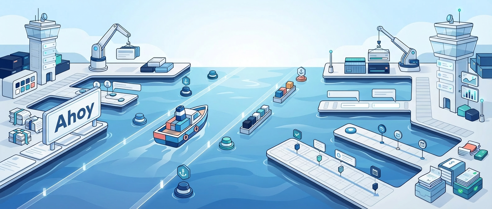

<p align="center">
  
</p>

<p align="center">
  A living spec system and interactive prototype environment for the Teamleader product —<br>powered by the <a href="https://github.com/teamleader/ahoy">Ahoy</a> design system and Claude Code.
</p>

<p align="center">
  
  
  
  
  
</p>

---

Designers describe what they want. The specs tell Claude how to build it correctly — using the right tokens, the right components, and the right import paths every time. **No code required.**

---

## What is this?

Two things working together:

| | What it is | Where it lives |
|---|---|---|
| **Spec library** | Written design decisions for every Ahoy component — tokens, states, anatomy, usage rules | `specs/` |
| **Live prototype** | A Vite + React app that Claude edits in real time as you describe what you want | `ahoy-demo/` |

---

## Documentation

| Guide | What's in it |
|---|---|
| [Getting Started](docs/getting-started.md) | Prerequisites, installation, starting the prototype |
| [Using Claude Code](docs/using-claude.md) | How to prompt Claude, example conversations, tips |
| [The Spec System](docs/spec-system.md) | Folder structure, spec anatomy, the four tiers |
| [Figma Integration](docs/figma.md) | `/figma-spec` workflow, tips for good output |
| [Tokens & Audit](docs/tokens.md) | Token reference tables, running the audit, fixing violations |
| [Developer Handoff](docs/handoff.md) | Handoff checklist, what developers receive |
| [Quick Reference](docs/quick-reference.md) | All spec lookups, token cheat sheet, key commands |

---

## Quick start

```bash
# Install dependencies (once)
cd ahoy-demo && npm install

# Start the prototype
npm run dev
```

Open [http://localhost:5173](http://localhost:5173) — the **Get started** page in the sidebar is a live, interactive onboarding guide. It walks through the token system, spec tiers, component props, and Claude commands with real examples you can click and copy.

Then in a second terminal:

```bash
claude
```

Describe what you want to build. Claude handles the rest.

---

## What's already built

The app shell is live at [http://localhost:5173](http://localhost:5173):

| Component | Spec | Description |
|---|---|---|
| **Sidebar** | [specs/organisms/sidebar.md](specs/organisms/sidebar.md) | Full vertical nav with 16 destinations and Ahoy icons |
| **TopBar** | [specs/organisms/top-bar.md](specs/organisms/top-bar.md) | Fixed top bar with search, notifications, avatar, and upgrade CTA |

The shell layout (sidebar + top bar + content area) follows [specs/patterns/layout.md](specs/patterns/layout.md).

---

## Key commands

| Command | What it does |
|---|---|
| `npm run dev` | Start the live prototype |
| `node scripts/token-audit.js` | Check for raw values that should be tokens |
| `/figma-spec <figma-url>` | Create a spec from a Figma component |
| `/create-spec <name>` | Create a spec via guided Q&A interview |
| `/create-component-from-spec <spec>` | Scaffold a React component from an existing spec |
| `/spec-lookup <description>` | Surface relevant specs before building |

---

## FAQ

<details>
<summary><strong>The browser shows a blank page.</strong></summary>

Make sure Terminal 1 is running `npm run dev` inside the `ahoy-demo/` folder. If the terminal shows an error, check that Node.js v18+ is installed: `node --version`.
</details>

<details>
<summary><strong>Port 5173 is already in use.</strong></summary>

Another instance of the dev server is running. Close it first, or start on a different port: `npm run dev -- --port 5174`.
</details>

<details>
<summary><strong>Claude says it can't find a component or spec.</strong></summary>

The spec might not exist yet. Use `/figma-spec <url>` if you have a Figma link, or `/create-spec <name>` for a guided Q&A. Then try your original request again.
</details>

<details>
<summary><strong>The page didn't update after Claude made a change.</strong></summary>

The browser should update automatically (hot reload). If it doesn't, do a hard refresh (`Cmd+Shift+R` on Mac). If the dev server stopped, restart it in Terminal 1.
</details>

<details>
<summary><strong>The token audit is failing.</strong></summary>

Ask Claude directly:
```
Run the token audit and fix any violations you find.
```
Claude will read the error output and patch the offending values.
</details>

<details>
<summary><strong>Claude's output doesn't match the Figma design.</strong></summary>

Point Claude at the spec file explicitly:
```
Re-read specs/organisms/top-bar.md and check if the layout matches the Anatomy section.
```
Or re-run `/figma-spec` with the same URL — Claude will offer to update the existing spec rather than create a duplicate.
</details>

<details>
<summary><strong>`npm install` failed.</strong></summary>

Make sure you are inside the `ahoy-demo/` folder, not the project root. If errors mention Node.js version, run `node --version` — v18 or higher is required.
</details>

<details>
<summary><strong>Claude keeps using the wrong component or tokens.</strong></summary>

Reference the spec file directly in your message:
```
Following specs/atoms/button.md, add a disabled primary button below the form.
```
</details>

<details>
<summary><strong>I created a new spec but Claude doesn't seem to use it.</strong></summary>

Specs are read on demand — no restart needed. Just ask Claude to use it by name or path:
```
Build the notification banner from specs/organisms/notification-banner.md.
```
</details>

<details>
<summary><strong>How do I know the prototype is ready to hand off?</strong></summary>

Run `node scripts/token-audit.js` — it must exit with zero violations. Check that every component you've added has a spec file in `specs/`. Then share `ahoy-demo/src/` and `specs/` with the developer. See [docs/handoff.md](docs/handoff.md) for the full checklist.
</details>

---

*Built with [Ahoy](https://github.com/teamleader/ahoy) · Prototyped with [Claude Code](https://claude.ai/code)*
